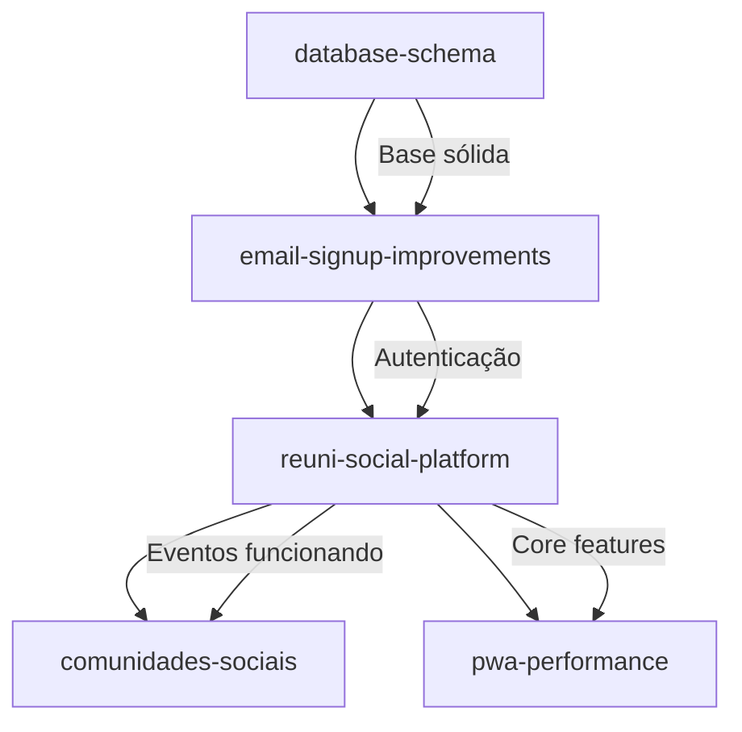

# Specs do Projeto Reuni - Visão Geral

## 📋 Ordem de Implementação

### 🔴 **CRÍTICO - Implementar PRIMEIRO**
#### 1. **database-schema** (18 tarefas)
- **Objetivo**: Schema de banco consistente, seguro e otimizado
- **Status**: 🚨 **MIGRAÇÃO CRÍTICA CRIADA** - `016_fix_database_inconsistencies.sql`
- **Ação Urgente**: Executar `supabase db push` IMEDIATAMENTE
- **Dependências**: Nenhuma
- **Impacto**: Base para todas as outras specs

### 🟡 **ALTA PRIORIDADE**
#### 2. **email-signup-improvements** (13 tarefas)
- **Objetivo**: Sistema de autenticação enterprise-grade
- **Status**: Pronto para implementação após database-schema
- **Dependências**: database-schema
- **Impacto**: Base segura para todas as funcionalidades

### 🟢 **CORE FEATURES**
#### 3. **reuni-social-platform** (10 tarefas)
- **Objetivo**: Sistema de eventos (criação, descoberta, participação)
- **Status**: Focado apenas em eventos, traduzido para português
- **Dependências**: database-schema + email-signup-improvements
- **Impacto**: Funcionalidade principal da plataforma

### 🔵 **FEATURES AVANÇADAS**
#### 4. **comunidades-sociais** (10 tarefas)
- **Objetivo**: Sistema de comunidades e interação social
- **Status**: Nova spec criada, completa
- **Dependências**: Todas as specs anteriores
- **Impacto**: Funcionalidades sociais avançadas

#### 5. **pwa-performance** (14 tarefas)
- **Objetivo**: PWA, offline, performance e notificações
- **Status**: Nova spec criada, pode ser implementada em paralelo
- **Dependências**: Pode começar após sistema de eventos básico
- **Impacto**: Experiência mobile nativa

## 🏗️ Arquitetura das Specs

### Dependências entre Specs


### Distribuição de Tarefas
- **database-schema**: 18 tarefas (Base crítica)
- **email-signup-improvements**: 13 tarefas (Autenticação)
- **reuni-social-platform**: 10 tarefas (Eventos)
- **comunidades-sociais**: 10 tarefas (Social)
- **pwa-performance**: 14 tarefas (Mobile/PWA)
- **TOTAL**: 65 tarefas organizadas

## 📊 Status Atual das Specs

### ✅ **Completas e Prontas**
- **database-schema**: Requirements, Design, Tasks ✅
- **email-signup-improvements**: Requirements, Design, Tasks ✅
- **comunidades-sociais**: Requirements, Design, Tasks ✅
- **pwa-performance**: Requirements, Design, Tasks ✅

### 🔄 **Em Atualização**
- **reuni-social-platform**: Requirements ✅, Design 🔄, Tasks ✅

## 🎯 Benefícios da Reorganização

### ✅ **Separação Clara de Responsabilidades**
- Cada spec tem foco específico e bem definido
- Tarefas relacionadas agrupadas logicamente
- Dependências explícitas entre specs

### ✅ **Tradução Completa**
- Todas as specs em português brasileiro
- Terminologia técnica consistente
- Descrições detalhadas e específicas

### ✅ **Melhor Gerenciamento**
- Specs menores e mais gerenciáveis (10-18 tarefas cada)
- Fases bem estruturadas por complexidade
- Requirements específicos referenciados

### ✅ **Fluxo de Implementação Claro**
1. **Base sólida**: Database schema primeiro
2. **Autenticação robusta**: Sistema seguro de login
3. **Core features**: Sistema de eventos funcionando
4. **Features avançadas**: Comunidades e PWA

## 🚀 Como Começar

### Passo 1: Aplicar Migração Crítica (URGENTE)
```bash
# EXECUTAR IMEDIATAMENTE
supabase db push

# OU aplicar manualmente
psql -f supabase/migrations/016_fix_database_inconsistencies.sql

# Verificar se aplicou corretamente
supabase db diff
```

### Passo 2: Continuar Database Schema
```bash
# Após aplicar migração crítica
.kiro/specs/database-schema/tasks.md

# Continuar com as tarefas restantes
```

### Passo 3: Autenticação
```bash
# Após completar database schema
.kiro/specs/email-signup-improvements/tasks.md

# Começar pela tarefa 1: Middleware de autenticação
```

### Passo 4: Sistema de Eventos
```bash
# Após completar autenticação
.kiro/specs/reuni-social-platform/tasks.md

# Começar pela tarefa 1: Modelos de dados de eventos
```

## 📝 Notas Importantes

### ⚠️ **Crítico**
- **Database schema DEVE ser implementado primeiro**
- Todas as outras specs dependem de um banco consistente
- Não pule etapas - a ordem é fundamental

### 🔒 **Segurança**
- RLS implementado em todas as tabelas
- Middleware de autenticação robusto
- Políticas de segurança testadas

### 📱 **Mobile-First**
- PWA com funcionalidade offline
- Interface otimizada para touch
- Performance otimizada para mobile

### 🧪 **Qualidade**
- Testes em todas as specs
- Documentação completa
- Padrões de código consistentes

---

**Total de Tarefas**: 65 tarefas organizadas em 5 specs especializadas
**Tempo Estimado**: 8-12 semanas (dependendo da equipe)
**Prioridade**: Database → Auth → Events → Communities → PWA