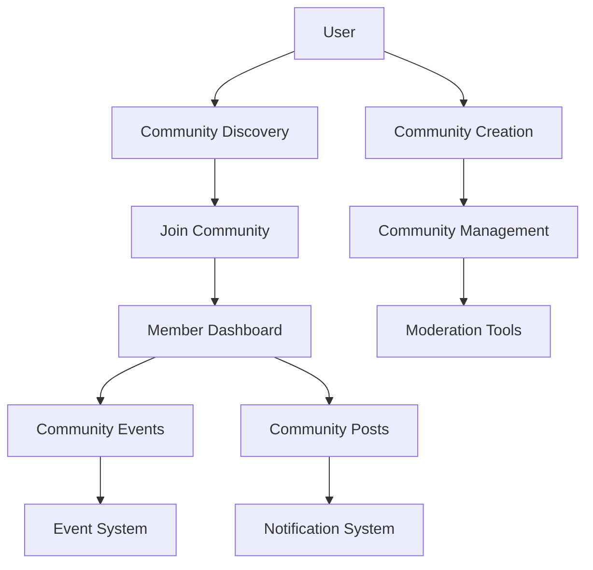

# Design Document - Sistema de Comunidades Sociais

## Overview

O sistema de comunidades do Reuni permite que usuários criem grupos temáticos baseados em interesses comuns, facilitando networking e organização de eventos específicos. A arquitetura é construída sobre o sistema de eventos existente, adicionando camadas de organização social e comunicação entre membros.

## Architecture

### Core Components
- **Community Management**: Criação, edição e administração de comunidades
- **Membership System**: Gestão de membros com diferentes níveis de permissão
- **Content Moderation**: Ferramentas para moderação de conteúdo e membros
- **Communication Layer**: Sistema de posts, comentários e notificações
- **Event Integration**: Integração com sistema de eventos existente

### Data Flow


## Components and Interfaces

### 1. Community Management Components

```typescript
interface Community {
  id: string
  nome: string
  descricao: string
  categoria: string
  imagem_url?: string
  criador_id: string
  privada: boolean
  regras?: string
  membros_count: number
  eventos_count: number
  created_at: string
}

interface CommunityForm {
  initialData?: Partial<Community>
  onSubmit: (data: CommunityData) => Promise<void>
  validation: CommunityValidationSchema
}

interface CommunityCard {
  community: Community
  userMembership?: MembershipStatus
  onJoin: (communityId: string) => void
  onLeave: (communityId: string) => void
  showStats?: boolean
}
```

### 2. Membership System

```typescript
interface Member {
  id: string
  usuario_id: string
  comunidade_id: string
  role: 'admin' | 'moderator' | 'member'
  joined_at: string
  usuario: {
    nome: string
    email: string
    avatar?: string
  }
}

interface MembershipManager {
  members: Member[]
  onPromote: (memberId: string, newRole: string) => void
  onRemove: (memberId: string) => void
  onInvite: (email: string) => void
  currentUserRole: string
}
```

### 3. Community Posts System

```typescript
interface CommunityPost {
  id: string
  comunidade_id: string
  usuario_id: string
  conteudo: string
  imagens?: string[]
  likes_count: number
  comentarios_count: number
  created_at: string
  usuario: {
    nome: string
    avatar?: string
  }
}

interface PostForm {
  communityId: string
  onSubmit: (content: string, images?: File[]) => Promise<void>
  maxLength: number
  allowImages: boolean
}

interface PostFeed {
  communityId: string
  posts: CommunityPost[]
  onLoadMore: () => void
  onLike: (postId: string) => void
  onComment: (postId: string, comment: string) => void
}
```

## Data Models

### Communities Table
```sql
CREATE TABLE comunidades (
  id UUID DEFAULT gen_random_uuid() PRIMARY KEY,
  nome VARCHAR(100) NOT NULL,
  descricao TEXT,
  categoria VARCHAR(50) NOT NULL,
  imagem_url TEXT,
  criador_id UUID REFERENCES usuarios(id),
  privada BOOLEAN DEFAULT FALSE,
  regras TEXT,
  created_at TIMESTAMP WITH TIME ZONE DEFAULT NOW(),
  updated_at TIMESTAMP WITH TIME ZONE DEFAULT NOW()
);
```

### Community Members Table
```sql
CREATE TABLE membros_comunidade (
  id UUID DEFAULT gen_random_uuid() PRIMARY KEY,
  comunidade_id UUID REFERENCES comunidades(id) ON DELETE CASCADE,
  usuario_id UUID REFERENCES usuarios(id) ON DELETE CASCADE,
  role VARCHAR(20) DEFAULT 'member' CHECK (role IN ('admin', 'moderator', 'member')),
  joined_at TIMESTAMP WITH TIME ZONE DEFAULT NOW(),
  UNIQUE(comunidade_id, usuario_id)
);
```

### Community Posts Table
```sql
CREATE TABLE posts_comunidade (
  id UUID DEFAULT gen_random_uuid() PRIMARY KEY,
  comunidade_id UUID REFERENCES comunidades(id) ON DELETE CASCADE,
  usuario_id UUID REFERENCES usuarios(id) ON DELETE CASCADE,
  conteudo TEXT NOT NULL,
  imagens TEXT[],
  likes_count INTEGER DEFAULT 0,
  created_at TIMESTAMP WITH TIME ZONE DEFAULT NOW(),
  updated_at TIMESTAMP WITH TIME ZONE DEFAULT NOW()
);
```

### Community Post Comments Table
```sql
CREATE TABLE comentarios_post_comunidade (
  id UUID DEFAULT gen_random_uuid() PRIMARY KEY,
  post_id UUID REFERENCES posts_comunidade(id) ON DELETE CASCADE,
  usuario_id UUID REFERENCES usuarios(id) ON DELETE CASCADE,
  conteudo TEXT NOT NULL,
  created_at TIMESTAMP WITH TIME ZONE DEFAULT NOW()
);
```

## Error Handling

### Community Access Control
- Verificação de permissões baseada em role
- Validação de acesso a comunidades privadas
- Tratamento de tentativas de acesso não autorizado

### Content Moderation
- Validação de conteúdo antes da publicação
- Sistema de reports para conteúdo inadequado
- Ferramentas de moderação para administradores

## Testing Strategy

### Unit Tests
- Componentes de comunidade isolados
- Hooks de gerenciamento de membros
- Utilitários de validação e formatação

### Integration Tests
- Fluxo completo de criação de comunidade
- Sistema de convites e participação
- Integração com sistema de eventos

### E2E Tests
- Jornada completa do usuário
- Cenários de moderação
- Testes de permissões e acesso