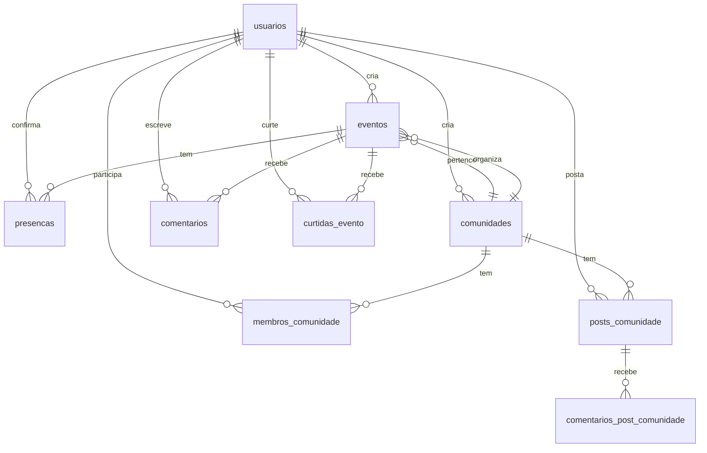

# Design Document - Schema de Banco de Dados Unificado

## Overview

Este design define um schema de banco de dados PostgreSQL robusto, seguro e otimizado para o Reuni. O schema é projetado para suportar todas as funcionalidades planejadas (autenticação, eventos, comunidades, PWA) com foco em performance, segurança e manutenibilidade. Todas as tabelas terão RLS adequado, índices otimizados e integridade referencial garantida.

## Architecture

### Database Design Principles
- **Security First**: RLS em todas as tabelas com dados de usuário
- **Performance Optimized**: Índices estratégicos para consultas frequentes
- **Data Integrity**: Foreign keys e constraints para consistência
- **Extensibility**: Schema flexível para futuras funcionalidades
- **Auditability**: Campos de auditoria e logs automáticos

### Schema Organization


## Data Models

### Core Tables

#### 1. Tabela usuarios (Base de Autenticação)
```sql
CREATE TABLE usuarios (
    id UUID PRIMARY KEY DEFAULT auth.uid(),
    nome VARCHAR(100),
    email VARCHAR(255) UNIQUE,
    avatar TEXT,
    bio TEXT,
    perfil_publico BOOLEAN DEFAULT TRUE,
    data_nascimento DATE,
    cidade VARCHAR(100),
    interesses TEXT[],
    created_at TIMESTAMP WITH TIME ZONE DEFAULT NOW(),
    updated_at TIMESTAMP WITH TIME ZONE DEFAULT NOW(),
    
    -- Constraints
    CONSTRAINT usuarios_email_valid CHECK (email ~* '^[A-Za-z0-9._%+-]+@[A-Za-z0-9.-]+\.[A-Za-z]{2,}$'),
    CONSTRAINT usuarios_nome_length CHECK (length(nome) >= 2),
    CONSTRAINT usuarios_bio_length CHECK (length(bio) <= 500)
);

-- RLS Policies
ALTER TABLE usuarios ENABLE ROW LEVEL SECURITY;

CREATE POLICY "usuarios_select_own" ON usuarios
    FOR SELECT USING (auth.uid() = id);

CREATE POLICY "usuarios_insert_own" ON usuarios
    FOR INSERT WITH CHECK (auth.uid() = id);

CREATE POLICY "usuarios_update_own" ON usuarios
    FOR UPDATE USING (auth.uid() = id) WITH CHECK (auth.uid() = id);

-- Índices
CREATE INDEX idx_usuarios_email ON usuarios(email);
CREATE INDEX idx_usuarios_cidade ON usuarios(cidade);
CREATE INDEX idx_usuarios_created_at ON usuarios(created_at);
CREATE INDEX idx_usuarios_interesses ON usuarios USING GIN(interesses);
```

#### 2. Tabela eventos (Sistema de Eventos)
```sql
CREATE TABLE eventos (
    id UUID PRIMARY KEY DEFAULT gen_random_uuid(),
    titulo VARCHAR(200) NOT NULL,
    descricao TEXT,
    local VARCHAR(300) NOT NULL,
    cidade VARCHAR(100) NOT NULL,
    data DATE NOT NULL,
    hora TIME NOT NULL,
    categoria VARCHAR(50) NOT NULL,
    imagem_url TEXT,
    organizador_id UUID NOT NULL REFERENCES usuarios(id) ON DELETE CASCADE,
    comunidade_id UUID REFERENCES comunidades(id) ON DELETE SET NULL,
    max_participantes INTEGER,
    preco DECIMAL(10,2) DEFAULT 0,
    tags TEXT[],
    status VARCHAR(20) DEFAULT 'ativo' CHECK (status IN ('ativo', 'cancelado', 'finalizado')),
    likes_count INTEGER DEFAULT 0,
    participantes_count INTEGER DEFAULT 0,
    created_at TIMESTAMP WITH TIME ZONE DEFAULT NOW(),
    updated_at TIMESTAMP WITH TIME ZONE DEFAULT NOW(),
    
    -- Constraints
    CONSTRAINT eventos_data_futura CHECK (data >= CURRENT_DATE),
    CONSTRAINT eventos_max_participantes_positivo CHECK (max_participantes > 0),
    CONSTRAINT eventos_preco_positivo CHECK (preco >= 0),
    CONSTRAINT eventos_titulo_length CHECK (length(titulo) >= 5)
);

-- RLS Policies
ALTER TABLE eventos ENABLE ROW LEVEL SECURITY;

CREATE POLICY "eventos_select_all" ON eventos
    FOR SELECT USING (true);

CREATE POLICY "eventos_insert_authenticated" ON eventos
    FOR INSERT TO authenticated WITH CHECK (auth.uid() = organizador_id);

CREATE POLICY "eventos_update_owner" ON eventos
    FOR UPDATE USING (auth.uid() = organizador_id) WITH CHECK (auth.uid() = organizador_id);

CREATE POLICY "eventos_delete_owner" ON eventos
    FOR DELETE USING (auth.uid() = organizador_id);

-- Índices
CREATE INDEX idx_eventos_data ON eventos(data);
CREATE INDEX idx_eventos_cidade ON eventos(cidade);
CREATE INDEX idx_eventos_categoria ON eventos(categoria);
CREATE INDEX idx_eventos_organizador ON eventos(organizador_id);
CREATE INDEX idx_eventos_comunidade ON eventos(comunidade_id);
CREATE INDEX idx_eventos_status ON eventos(status);
CREATE INDEX idx_eventos_tags ON eventos USING GIN(tags);
CREATE INDEX idx_eventos_texto ON eventos USING GIN(to_tsvector('portuguese', titulo || ' ' || coalesce(descricao, '')));
```

#### 3. Tabela presencas (Sistema de Participação)
```sql
CREATE TABLE presencas (
    id UUID PRIMARY KEY DEFAULT gen_random_uuid(),
    evento_id UUID NOT NULL REFERENCES eventos(id) ON DELETE CASCADE,
    usuario_id UUID NOT NULL REFERENCES usuarios(id) ON DELETE CASCADE,
    status VARCHAR(20) DEFAULT 'confirmado' CHECK (status IN ('confirmado', 'interessado', 'cancelado')),
    data_confirmacao TIMESTAMP WITH TIME ZONE DEFAULT NOW(),
    created_at TIMESTAMP WITH TIME ZONE DEFAULT NOW(),
    updated_at TIMESTAMP WITH TIME ZONE DEFAULT NOW(),
    
    -- Constraint de unicidade
    UNIQUE(evento_id, usuario_id)
);

-- RLS Policies
ALTER TABLE presencas ENABLE ROW LEVEL SECURITY;

CREATE POLICY "presencas_select_all" ON presencas
    FOR SELECT USING (true);

CREATE POLICY "presencas_insert_own" ON presencas
    FOR INSERT TO authenticated WITH CHECK (auth.uid() = usuario_id);

CREATE POLICY "presencas_update_own" ON presencas
    FOR UPDATE USING (auth.uid() = usuario_id) WITH CHECK (auth.uid() = usuario_id);

CREATE POLICY "presencas_delete_own" ON presencas
    FOR DELETE USING (auth.uid() = usuario_id);

-- Índices
CREATE INDEX idx_presencas_evento ON presencas(evento_id);
CREATE INDEX idx_presencas_usuario ON presencas(usuario_id);
CREATE INDEX idx_presencas_status ON presencas(status);
CREATE INDEX idx_presencas_data ON presencas(data_confirmacao);
```

#### 4. Tabela comunidades (Sistema de Comunidades)
```sql
CREATE TABLE comunidades (
    id UUID PRIMARY KEY DEFAULT gen_random_uuid(),
    nome VARCHAR(100) NOT NULL,
    descricao TEXT,
    categoria VARCHAR(50) NOT NULL,
    imagem_url TEXT,
    criador_id UUID NOT NULL REFERENCES usuarios(id) ON DELETE CASCADE,
    privada BOOLEAN DEFAULT FALSE,
    regras TEXT,
    cidade VARCHAR(100),
    tags TEXT[],
    membros_count INTEGER DEFAULT 1,
    eventos_count INTEGER DEFAULT 0,
    created_at TIMESTAMP WITH TIME ZONE DEFAULT NOW(),
    updated_at TIMESTAMP WITH TIME ZONE DEFAULT NOW(),
    
    -- Constraints
    CONSTRAINT comunidades_nome_length CHECK (length(nome) >= 3),
    CONSTRAINT comunidades_descricao_length CHECK (length(descricao) <= 1000)
);

-- RLS Policies
ALTER TABLE comunidades ENABLE ROW LEVEL SECURITY;

CREATE POLICY "comunidades_select_public" ON comunidades
    FOR SELECT USING (NOT privada OR auth.uid() IN (
        SELECT usuario_id FROM membros_comunidade WHERE comunidade_id = id
    ));

CREATE POLICY "comunidades_insert_authenticated" ON comunidades
    FOR INSERT TO authenticated WITH CHECK (auth.uid() = criador_id);

CREATE POLICY "comunidades_update_admin" ON comunidades
    FOR UPDATE USING (
        auth.uid() = criador_id OR 
        auth.uid() IN (
            SELECT usuario_id FROM membros_comunidade 
            WHERE comunidade_id = id AND role IN ('admin', 'moderator')
        )
    );

-- Índices
CREATE INDEX idx_comunidades_categoria ON comunidades(categoria);
CREATE INDEX idx_comunidades_cidade ON comunidades(cidade);
CREATE INDEX idx_comunidades_criador ON comunidades(criador_id);
CREATE INDEX idx_comunidades_privada ON comunidades(privada);
CREATE INDEX idx_comunidades_tags ON comunidades USING GIN(tags);
CREATE INDEX idx_comunidades_texto ON comunidades USING GIN(to_tsvector('portuguese', nome || ' ' || coalesce(descricao, '')));
```

#### 5. Tabela membros_comunidade (Participação em Comunidades)
```sql
CREATE TABLE membros_comunidade (
    id UUID PRIMARY KEY DEFAULT gen_random_uuid(),
    comunidade_id UUID NOT NULL REFERENCES comunidades(id) ON DELETE CASCADE,
    usuario_id UUID NOT NULL REFERENCES usuarios(id) ON DELETE CASCADE,
    role VARCHAR(20) DEFAULT 'member' CHECK (role IN ('admin', 'moderator', 'member')),
    joined_at TIMESTAMP WITH TIME ZONE DEFAULT NOW(),
    
    -- Constraint de unicidade
    UNIQUE(comunidade_id, usuario_id)
);

-- RLS Policies
ALTER TABLE membros_comunidade ENABLE ROW LEVEL SECURITY;

CREATE POLICY "membros_select_community_members" ON membros_comunidade
    FOR SELECT USING (
        auth.uid() = usuario_id OR
        auth.uid() IN (
            SELECT usuario_id FROM membros_comunidade mc2 
            WHERE mc2.comunidade_id = comunidade_id
        )
    );

CREATE POLICY "membros_insert_own" ON membros_comunidade
    FOR INSERT TO authenticated WITH CHECK (auth.uid() = usuario_id);

CREATE POLICY "membros_delete_own_or_admin" ON membros_comunidade
    FOR DELETE USING (
        auth.uid() = usuario_id OR
        auth.uid() IN (
            SELECT usuario_id FROM membros_comunidade mc2 
            WHERE mc2.comunidade_id = comunidade_id AND mc2.role IN ('admin', 'moderator')
        )
    );

-- Índices
CREATE INDEX idx_membros_comunidade ON membros_comunidade(comunidade_id);
CREATE INDEX idx_membros_usuario ON membros_comunidade(usuario_id);
CREATE INDEX idx_membros_role ON membros_comunidade(role);
```

### Supporting Tables

#### 6. Tabela comentarios (Sistema de Comentários)
```sql
CREATE TABLE comentarios (
    id UUID PRIMARY KEY DEFAULT gen_random_uuid(),
    evento_id UUID NOT NULL REFERENCES eventos(id) ON DELETE CASCADE,
    usuario_id UUID NOT NULL REFERENCES usuarios(id) ON DELETE CASCADE,
    conteudo TEXT NOT NULL,
    parent_id UUID REFERENCES comentarios(id) ON DELETE CASCADE,
    created_at TIMESTAMP WITH TIME ZONE DEFAULT NOW(),
    updated_at TIMESTAMP WITH TIME ZONE DEFAULT NOW(),
    
    -- Constraints
    CONSTRAINT comentarios_conteudo_length CHECK (length(conteudo) >= 1 AND length(conteudo) <= 1000)
);

-- RLS Policies
ALTER TABLE comentarios ENABLE ROW LEVEL SECURITY;

CREATE POLICY "comentarios_select_all" ON comentarios
    FOR SELECT USING (true);

CREATE POLICY "comentarios_insert_authenticated" ON comentarios
    FOR INSERT TO authenticated WITH CHECK (auth.uid() = usuario_id);

CREATE POLICY "comentarios_update_own" ON comentarios
    FOR UPDATE USING (auth.uid() = usuario_id) WITH CHECK (auth.uid() = usuario_id);

CREATE POLICY "comentarios_delete_own" ON comentarios
    FOR DELETE USING (auth.uid() = usuario_id);

-- Índices
CREATE INDEX idx_comentarios_evento ON comentarios(evento_id);
CREATE INDEX idx_comentarios_usuario ON comentarios(usuario_id);
CREATE INDEX idx_comentarios_parent ON comentarios(parent_id);
CREATE INDEX idx_comentarios_created_at ON comentarios(created_at);
```

#### 7. Tabela curtidas_evento (Sistema de Likes)
```sql
CREATE TABLE curtidas_evento (
    id UUID PRIMARY KEY DEFAULT gen_random_uuid(),
    evento_id UUID NOT NULL REFERENCES eventos(id) ON DELETE CASCADE,
    usuario_id UUID NOT NULL REFERENCES usuarios(id) ON DELETE CASCADE,
    created_at TIMESTAMP WITH TIME ZONE DEFAULT NOW(),
    
    -- Constraint de unicidade
    UNIQUE(evento_id, usuario_id)
);

-- RLS Policies
ALTER TABLE curtidas_evento ENABLE ROW LEVEL SECURITY;

CREATE POLICY "curtidas_select_all" ON curtidas_evento
    FOR SELECT USING (true);

CREATE POLICY "curtidas_insert_own" ON curtidas_evento
    FOR INSERT TO authenticated WITH CHECK (auth.uid() = usuario_id);

CREATE POLICY "curtidas_delete_own" ON curtidas_evento
    FOR DELETE USING (auth.uid() = usuario_id);

-- Índices
CREATE INDEX idx_curtidas_evento ON curtidas_evento(evento_id);
CREATE INDEX idx_curtidas_usuario ON curtidas_evento(usuario_id);
```

#### 8. Tabela posts_comunidade (Posts de Comunidade)
```sql
CREATE TABLE posts_comunidade (
    id UUID PRIMARY KEY DEFAULT gen_random_uuid(),
    comunidade_id UUID NOT NULL REFERENCES comunidades(id) ON DELETE CASCADE,
    usuario_id UUID NOT NULL REFERENCES usuarios(id) ON DELETE CASCADE,
    conteudo TEXT NOT NULL,
    imagens TEXT[],
    likes_count INTEGER DEFAULT 0,
    comentarios_count INTEGER DEFAULT 0,
    created_at TIMESTAMP WITH TIME ZONE DEFAULT NOW(),
    updated_at TIMESTAMP WITH TIME ZONE DEFAULT NOW(),
    
    -- Constraints
    CONSTRAINT posts_conteudo_length CHECK (length(conteudo) >= 1 AND length(conteudo) <= 2000)
);

-- RLS Policies
ALTER TABLE posts_comunidade ENABLE ROW LEVEL SECURITY;

CREATE POLICY "posts_select_community_members" ON posts_comunidade
    FOR SELECT USING (
        auth.uid() IN (
            SELECT usuario_id FROM membros_comunidade 
            WHERE comunidade_id = posts_comunidade.comunidade_id
        )
    );

CREATE POLICY "posts_insert_community_members" ON posts_comunidade
    FOR INSERT TO authenticated WITH CHECK (
        auth.uid() = usuario_id AND
        auth.uid() IN (
            SELECT usuario_id FROM membros_comunidade 
            WHERE comunidade_id = posts_comunidade.comunidade_id
        )
    );

-- Índices
CREATE INDEX idx_posts_comunidade ON posts_comunidade(comunidade_id);
CREATE INDEX idx_posts_usuario ON posts_comunidade(usuario_id);
CREATE INDEX idx_posts_created_at ON posts_comunidade(created_at);
```

## Triggers and Functions

### 1. Trigger para updated_at
```sql
CREATE OR REPLACE FUNCTION update_updated_at_column()
RETURNS TRIGGER AS $
BEGIN
    NEW.updated_at = NOW();
    RETURN NEW;
END;
$ LANGUAGE plpgsql;

-- Aplicar em todas as tabelas relevantes
CREATE TRIGGER update_usuarios_updated_at BEFORE UPDATE ON usuarios
    FOR EACH ROW EXECUTE FUNCTION update_updated_at_column();

CREATE TRIGGER update_eventos_updated_at BEFORE UPDATE ON eventos
    FOR EACH ROW EXECUTE FUNCTION update_updated_at_column();

CREATE TRIGGER update_comunidades_updated_at BEFORE UPDATE ON comunidades
    FOR EACH ROW EXECUTE FUNCTION update_updated_at_column();
```

### 2. Triggers para Contadores
```sql
-- Função para atualizar contador de participantes
CREATE OR REPLACE FUNCTION update_evento_participantes_count()
RETURNS TRIGGER AS $
BEGIN
    IF TG_OP = 'INSERT' AND NEW.status = 'confirmado' THEN
        UPDATE eventos SET participantes_count = participantes_count + 1 
        WHERE id = NEW.evento_id;
    ELSIF TG_OP = 'UPDATE' THEN
        IF OLD.status != 'confirmado' AND NEW.status = 'confirmado' THEN
            UPDATE eventos SET participantes_count = participantes_count + 1 
            WHERE id = NEW.evento_id;
        ELSIF OLD.status = 'confirmado' AND NEW.status != 'confirmado' THEN
            UPDATE eventos SET participantes_count = participantes_count - 1 
            WHERE id = NEW.evento_id;
        END IF;
    ELSIF TG_OP = 'DELETE' AND OLD.status = 'confirmado' THEN
        UPDATE eventos SET participantes_count = participantes_count - 1 
        WHERE id = OLD.evento_id;
    END IF;
    
    RETURN COALESCE(NEW, OLD);
END;
$ LANGUAGE plpgsql;

CREATE TRIGGER trigger_update_participantes_count
    AFTER INSERT OR UPDATE OR DELETE ON presencas
    FOR EACH ROW EXECUTE FUNCTION update_evento_participantes_count();
```

### 3. Função para Criação Automática de Membro Admin
```sql
-- Quando uma comunidade é criada, o criador vira admin automaticamente
CREATE OR REPLACE FUNCTION create_community_admin()
RETURNS TRIGGER AS $
BEGIN
    INSERT INTO membros_comunidade (comunidade_id, usuario_id, role)
    VALUES (NEW.id, NEW.criador_id, 'admin');
    RETURN NEW;
END;
$ LANGUAGE plpgsql;

CREATE TRIGGER trigger_create_community_admin
    AFTER INSERT ON comunidades
    FOR EACH ROW EXECUTE FUNCTION create_community_admin();
```

## Security Considerations

### RLS Strategy
- **Public Data**: Eventos públicos visíveis para todos
- **User Data**: Usuários veem apenas seus próprios dados
- **Community Data**: Membros veem dados da comunidade
- **Admin Data**: Admins têm acesso expandido

### Performance Optimization
- **Strategic Indexes**: Índices em campos frequentemente consultados
- **Full-Text Search**: Busca otimizada em títulos e descrições
- **Composite Indexes**: Para consultas complexas
- **Partial Indexes**: Para consultas condicionais

### Data Integrity
- **Foreign Keys**: Relacionamentos garantidos
- **Check Constraints**: Validação de dados
- **Unique Constraints**: Prevenção de duplicatas
- **Triggers**: Automação de operações