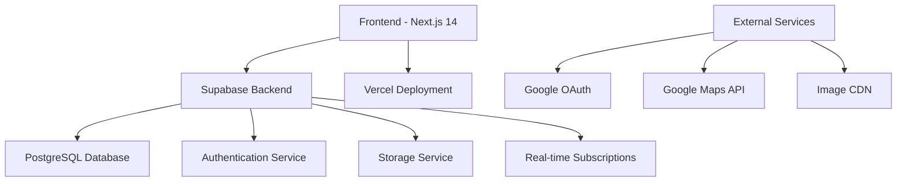

# Design Document - Reuni Social Platform

## Overview

Reuni é uma plataforma social moderna focada em eventos reais, construída com Next.js 14, TypeScript, Tailwind CSS e Supabase. A arquitetura segue padrões modernos de desenvolvimento web com foco em performance, escalabilidade e experiência do usuário.

## Architecture

### High-Level Architecture



### Technology Stack

- **Frontend**: Next.js 14 (App Router), React 18, TypeScript
- **Styling**: Tailwind CSS com tema customizado
- **Backend**: Supabase (PostgreSQL, Auth, Storage, Real-time)
- **Authentication**: Supabase Auth + Google OAuth
- **Deployment**: Vercel
- **Icons**: Lucide React
- **State Management**: React Hooks + Context API

## Components and Interfaces

### Core Components

#### 1. Authentication System
```typescript
// useAuth Hook Interface
interface AuthHook {
  user: User | null
  loading: boolean
  isAuthenticated: boolean
  signIn: (email: string, password: string) => Promise<AuthResponse>
  signUp: (email: string, password: string, metadata?: any) => Promise<AuthResponse>
  signOut: () => Promise<void>
  signInWithGoogle: () => Promise<AuthResponse>
}
```

#### 2. Layout Components
- **Header**: Logo, busca, notificações, menu do usuário
- **LeftSidebar**: Navegação principal, comunidades
- **MainFeed**: Carrossel de destaques, filtros, cards de eventos
- **RightSidebar**: Amigos online, sugestões, ações rápidas

#### 3. Event Components
```typescript
interface EventCard {
  event: Event
  onAttend: (eventId: string) => void
  onShare: (eventId: string) => void
  onComment: (eventId: string, comment: string) => void
}
```

#### 4. Modal System
- **AuthModal**: Login/cadastro com validação
- **EventModal**: Criação/edição de eventos
- **ConfirmModal**: Confirmações de ações

### State Management Strategy

#### 1. Global State (Context)
- User authentication state
- Theme preferences
- Notification settings

#### 2. Local State (useState)
- Form inputs
- Modal visibility
- Loading states

#### 3. Server State (Supabase)
- Events data
- User profiles
- Communities
- Real-time subscriptions

## Data Models

### Database Schema

#### Users Table
```sql
CREATE TABLE usuarios (
  id UUID DEFAULT gen_random_uuid() PRIMARY KEY,
  nome VARCHAR(100) NOT NULL,
  email VARCHAR(255) UNIQUE NOT NULL,
  avatar TEXT,
  bio TEXT,
  created_at TIMESTAMP WITH TIME ZONE DEFAULT NOW(),
  updated_at TIMESTAMP WITH TIME ZONE DEFAULT NOW()
);
```

#### Events Table
```sql
CREATE TABLE eventos (
  id UUID DEFAULT gen_random_uuid() PRIMARY KEY,
  titulo VARCHAR(200) NOT NULL,
  descricao TEXT,
  data DATE NOT NULL,
  hora TIME NOT NULL,
  local VARCHAR(300) NOT NULL,
  categoria VARCHAR(50) NOT NULL,
  imagem_url TEXT,
  organizador_id UUID REFERENCES usuarios(id),
  max_participantes INTEGER,
  created_at TIMESTAMP WITH TIME ZONE DEFAULT NOW(),
  updated_at TIMESTAMP WITH TIME ZONE DEFAULT NOW()
);
```

#### Attendances Table
```sql
CREATE TABLE presencas (
  id UUID DEFAULT gen_random_uuid() PRIMARY KEY,
  evento_id UUID REFERENCES eventos(id) ON DELETE CASCADE,
  usuario_id UUID REFERENCES usuarios(id) ON DELETE CASCADE,
  status VARCHAR(20) DEFAULT 'confirmado' CHECK (status IN ('confirmado', 'interessado', 'cancelado')),
  created_at TIMESTAMP WITH TIME ZONE DEFAULT NOW(),
  UNIQUE(evento_id, usuario_id)
);
```

#### Communities Table
```sql
CREATE TABLE comunidades (
  id UUID DEFAULT gen_random_uuid() PRIMARY KEY,
  nome VARCHAR(100) NOT NULL,
  descricao TEXT,
  tipo VARCHAR(50) NOT NULL,
  imagem_url TEXT,
  criador_id UUID REFERENCES usuarios(id),
  privada BOOLEAN DEFAULT FALSE,
  created_at TIMESTAMP WITH TIME ZONE DEFAULT NOW()
);
```

### API Design

#### REST Endpoints
```typescript
// Events API
GET    /api/events              // List events with filters
POST   /api/events              // Create new event
GET    /api/events/:id          // Get event details
PUT    /api/events/:id          // Update event
DELETE /api/events/:id          // Delete event

// Attendances API
POST   /api/events/:id/attend   // Confirm attendance
DELETE /api/events/:id/attend   // Cancel attendance
GET    /api/events/:id/attendees // List attendees

// Communities API
GET    /api/communities         // List communities
POST   /api/communities         // Create community
GET    /api/communities/:id     // Get community details
POST   /api/communities/:id/join // Join community
```

## Error Handling

### Client-Side Error Handling
```typescript
// Error Boundary Component
class ErrorBoundary extends React.Component {
  constructor(props) {
    super(props)
    this.state = { hasError: false, error: null }
  }

  static getDerivedStateFromError(error) {
    return { hasError: true, error }
  }

  componentDidCatch(error, errorInfo) {
    console.error('Error caught by boundary:', error, errorInfo)
    // Log to error reporting service
  }
}
```

### API Error Handling
```typescript
// Standardized error response
interface APIError {
  code: string
  message: string
  details?: any
  timestamp: string
}

// Error handling utility
const handleAPIError = (error: any): string => {
  if (error.code === 'PGRST301') return 'Evento não encontrado'
  if (error.code === '23505') return 'Você já confirmou presença neste evento'
  return 'Ocorreu um erro inesperado. Tente novamente.'
}
```

## Testing Strategy

### Unit Testing
- **Components**: React Testing Library + Jest
- **Hooks**: @testing-library/react-hooks
- **Utilities**: Jest

### Integration Testing
- **API Routes**: Supertest
- **Database**: Supabase local development
- **Authentication**: Mock Supabase client

### E2E Testing
- **Framework**: Playwright
- **Scenarios**: User journeys críticos
- **CI/CD**: Automated on PR

### Testing Structure
```
/tests
  /unit
    /components
    /hooks
    /utils
  /integration
    /api
    /database
  /e2e
    /user-flows
```

## Performance Optimization

### Frontend Optimization
1. **Code Splitting**: Dynamic imports para rotas
2. **Image Optimization**: Next.js Image component
3. **Bundle Analysis**: @next/bundle-analyzer
4. **Caching**: SWR para cache de dados
5. **Lazy Loading**: Componentes e imagens

### Database Optimization
1. **Indexing**: Índices em colunas frequentemente consultadas
2. **Query Optimization**: Uso de joins eficientes
3. **Connection Pooling**: Supabase connection pooling
4. **Caching**: Redis para cache de queries frequentes

### Real-time Features
```typescript
// Supabase real-time subscription
const subscription = supabase
  .channel('events')
  .on('postgres_changes', 
    { event: 'INSERT', schema: 'public', table: 'eventos' },
    (payload) => {
      // Update UI with new event
      setEvents(prev => [payload.new, ...prev])
    }
  )
  .subscribe()
```

## Security Considerations

### Authentication Security
- JWT tokens com expiração
- Refresh token rotation
- Rate limiting em endpoints de auth
- CSRF protection

### Data Security
- Row Level Security (RLS) no Supabase
- Input validation e sanitização
- SQL injection prevention
- XSS protection

### Privacy
- LGPD compliance
- Data encryption at rest
- Secure file uploads
- User data export/deletion

## Scalability Plan

### Horizontal Scaling
1. **CDN**: Cloudflare para assets estáticos
2. **Database**: Read replicas para queries
3. **Caching**: Redis cluster
4. **Load Balancing**: Vercel edge functions

### Monitoring
1. **Performance**: Vercel Analytics
2. **Errors**: Sentry integration
3. **Database**: Supabase monitoring
4. **User Analytics**: Privacy-focused analytics

### Platform Strategy

#### Phase 1: Web App Responsiva (0-6 meses)
1. **PWA Features**: Service Workers, offline-first, install prompt
2. **Web Push**: Notificações via navegador
3. **Mobile Optimization**: Layout adaptável e touch-friendly
4. **Performance**: Carregamento rápido e interações fluidas

#### Phase 2: Native Mobile Apps (6-12 meses)
1. **React Native**: Apps Android e iOS com código compartilhado
2. **Native Features**: Câmera, GPS, notificações push nativas
3. **App Store Distribution**: Google Play e Apple App Store
4. **Cross-Platform Sync**: Sincronização entre web e mobile
5. **AI Recommendations**: ML-based event suggestions